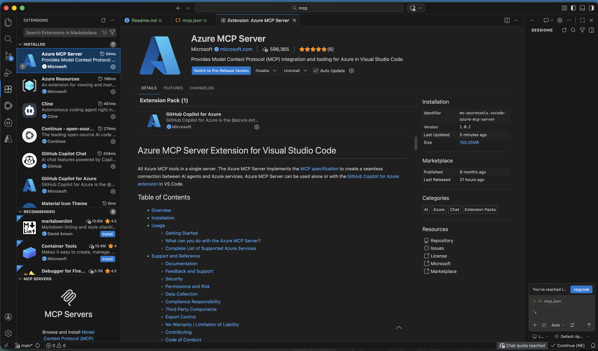
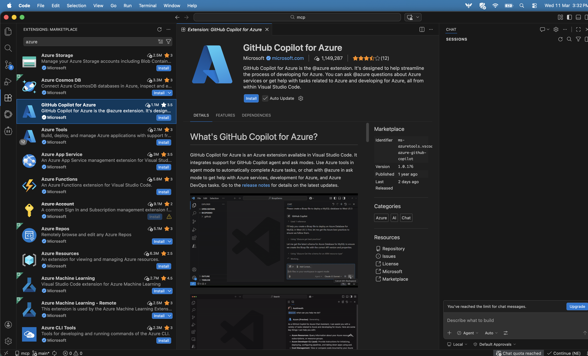
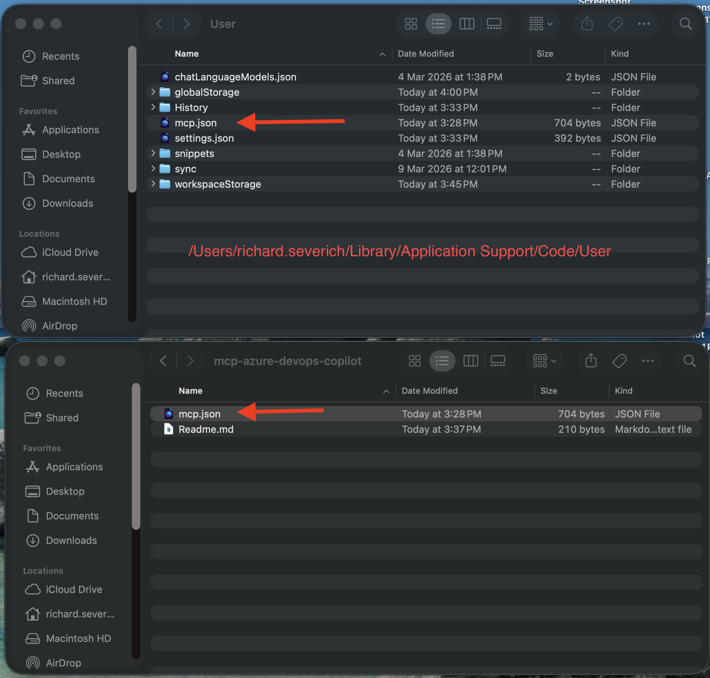
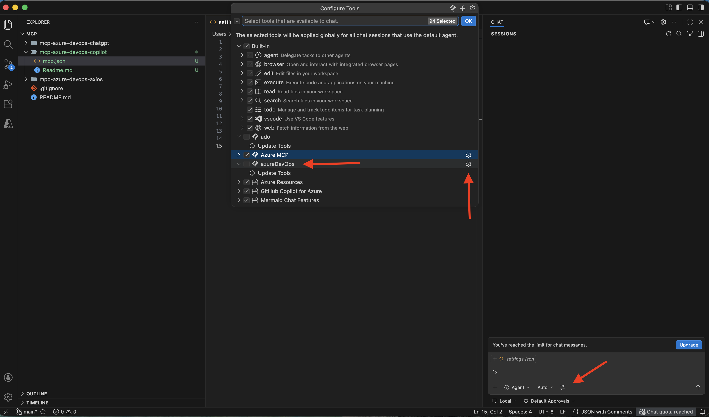

# Steps for use mcp

- Install Visual Studio Code
- Update mcp.json with your AZURE_DEVOPS_PAT
- Visual Studio Extension: Install Azure MCP Server
- Visual Studio Extension: Install Github copilot
- Visual Studio Extension: Install GitHub Copilot for Azure
- Copy mcp.json file to visual studio code "/Users/richard.severich/Library/Application Support/Code/User"
- Verify devops azure was added
- Ask quesions about your tickets.

## - Visual Studio Extension: Install Azure MCP Server

## - Visual Studio Extension: Install Github copilot
## - Visual Studio Extension: Install GitHub Copilot for Azure

## - Copy mcp.json file to visual studio code "/Users/richard.severich/Library/Application Support/Code/User"

## - Verify devops azure was added

## - Ask quesions about your tickets.
